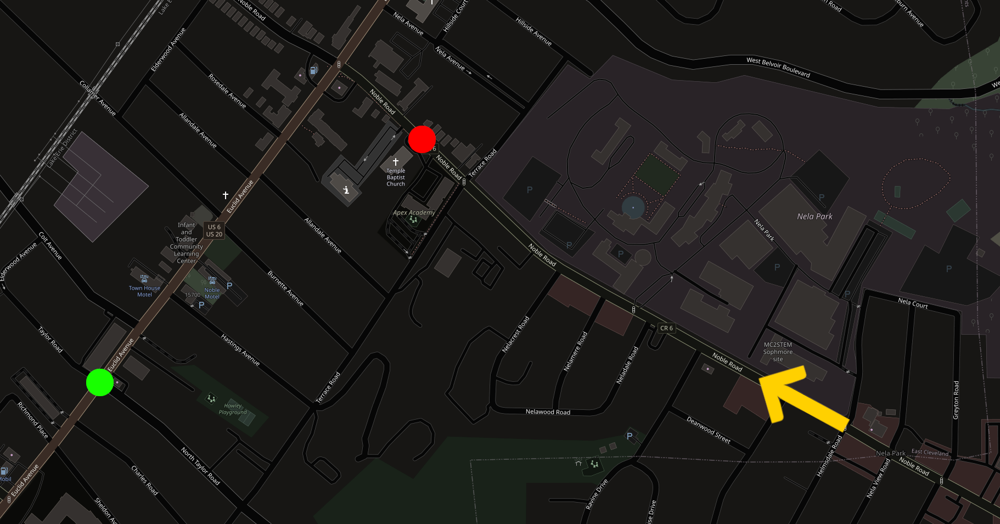
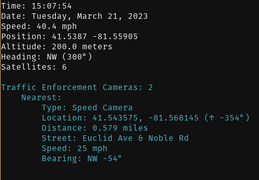
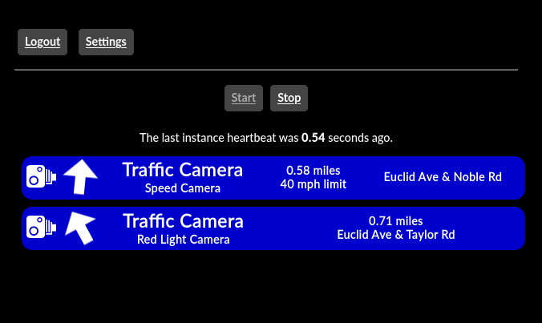

# Marksman

A graphical interface for [Assassin](https://v0lttech.com/assassin.php).

## Description

Assassin is a platform built to integrate devices and sensors in an automotive context. While it's plenty powerful alone, many users find it's command line interface to be limiting. Marksman is a companion tool that aims to be a clean, modern dashboard that displays information directly from Assassin from nearly any device with a web browser.

## Screenshots

### Traffic Camera Demonstration

Below is an example situation, depicting a car travelling down a road (yellow arrow) towards a speed camera (red dot), with a red-light camera nearby (green dot).

Below is the information displayed by the Assassin terminal interface.

Below is the information displayed by Marksman.

## Features

### Clear

The Marksman dashboard is designed to be clear and concise, just like the traditional dashboard in your car.

### Organized

Assassin is capable of handling information from many different sources. Marksman keeps all alerts organized, even when there are multiple alerts on screen.

### Fast

Assassin often provides very time sensitive alerts. As such, Marksman is designed to respond extremely quickly to new alerts.

### Lightweight

The Marksman interface is simple and lightweight, making it easy to use on a wide variety of devices.

### Adaptive

Regardless of whether you're using Marksman on a laptop or smartphone, the interface adapts and scales to make the most of the space available.

### Standalone

Despite integrating with Assassin, Marksman is an independent program. This means it can be closed during use without operation of Assassin in the background.
